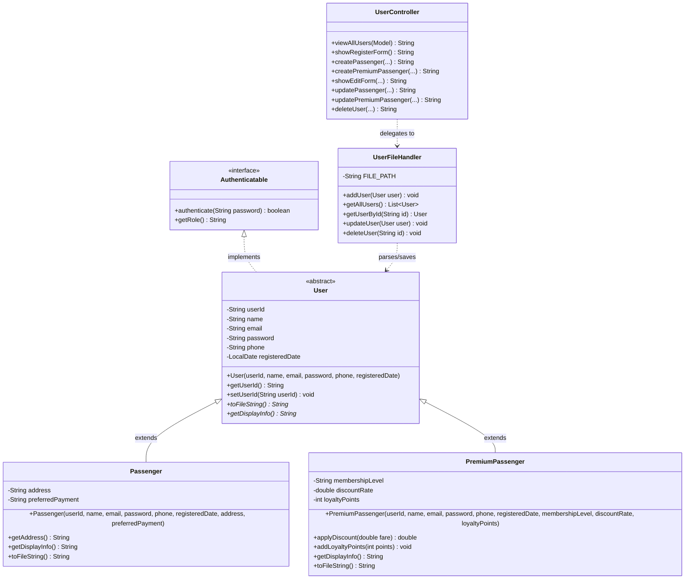

# 🚗 VibeRide Taxi Booking System - User Management Module

[](https://openjdk.org/projects/jdk/17/)
[](https://spring.io/projects/spring-boot)
[-blue.svg?style=flat-round)](https://en.wikipedia.org/wiki/Flat-file_database)

This repository contains the **User Management Module** for **VibeRide**, a comprehensive web-based Taxi Booking System developed as an Object-Oriented Programming (OOP) group project. The system is built using Spring Boot, Thymeleaf for the dynamic UI, and pure text file persistence to demonstrate advanced concepts in OOP and File I/O.

---

## 👥 Course & Developer Information

* **Course**: Object-Oriented Programming (OOP)
* **Module**: **User & Passenger Management**
* **Branch / Sub-system Identifier**: `IT25104080` (User-Management)
* **Student Registration Number**: **IT25104080**
* **Repository Role**: Core User Management, Authentication & Passenger Accounts

---

## 🏗️ Complete Project Architecture & Integration

VibeRide is a collaborative, modular system where each component is designed and managed by a separate team member under a dedicated registration branch. The complete system integrates the following modules:

| Branch / Identifier | Module Name | Core Responsibilities |
| :--- | :--- | :--- |
| **`IT25104080` (This Branch)** | **User Management** | Handles regular & premium passenger records, registration, profile updates, and login authentication. |
| **`IT25102476`** | **Driver & Vehicle Management** | Manages driver registration (Full-time/Part-time), vehicle allocation, availability, and details. |
| **`IT25101778`** | **Ride Booking** | Handles instant and scheduled bookings, status tracking, and ride matching. |
| **`IT25103414`** | **Payment and Billing** | Processes cash and card payments, dynamic fare calculation, and billing history. |
| **`IT25103107`** | **Feedback & Ratings** | Collects passenger ratings and detailed reviews for both drivers and the platform. |
| **`IT25104081`** | **Admin Management** | Facilitates system oversight, user/driver audits, and support dashboard administration. |

---

## 🛠️ Object-Oriented Programming (OOP) Design

The User Management module strictly adheres to the core principles of OOP to ensure maximum reusability, modularity, and clean structure.

### 1. Encapsulation
Data fields inside `User`, `Passenger`, and `PremiumPassenger` are declared as `private`. Direct access is blocked and they are instead exposed through public **getter** and **setter** methods. This ensures that any data validation or state change can be safely controlled.

### 2. Abstraction
* **`Authenticatable` (Interface)**: Defines the essential contract for password validation and role checking.
* **`User` (Abstract Class)**: Implements `Authenticatable` and acts as a blueprint. It contains shared attributes (ID, Name, Email, Password, Phone) and declares abstract methods (`toFileString()`, `getDisplayInfo()`) that subclasses *must* implement.

### 3. Inheritance
Both passenger categories extend the base `User` class:
* **`Passenger`**: Represents standard customers, adding properties like `address` and `preferredPayment`.
* **`PremiumPassenger`**: Represents VIP customers, inheriting all standard user attributes while adding specific traits: `membershipLevel`, `discountRate`, and `loyaltyPoints` with unique logic (`applyDiscount()`, `addLoyaltyPoints()`).

### 4. Polymorphism
* **Method Overriding**: `Passenger` and `PremiumPassenger` provide their own unique implementation of `getRole()`, `getDisplayInfo()`, and `toFileString()`.
* **Polymorphic Collections**: In `UserFileHandler.getAllUsers()`, a single `List<User>` holds instances of both subclasses. When iterating through this list, Java dynamically resolves the appropriate overridden methods at runtime (Dynamic Binding).

---

## 📊 Class Structure Diagram

The following Mermaid diagram illustrates the OOP class relationships within the **User Management** module:



---

## 💾 Flat-File Persistence & Data Format

The module does not require a database server. It uses flat-file storage situated in `data/users.txt`. 

### Record Structure
Data is stored as Comma-Separated Values (CSV). The first token identifies the subtype, enabling polymorphic instantiation when reading from disk:

* **Standard Passenger**:
  ```text
  PASSENGER,USR001,John Doe,john@example.com,pass123,0771234567,2026-05-21,123 Main St,Card
  ```
* **Premium Passenger**:
  ```text
  PREMIUM,USR002,Jane Smith,jane@example.com,pass456,0777654321,2026-05-21,Gold,0.15,120
  ```

### UserFileHandler Operations
* **Add**: Appends the CSV-serialized representation of the user (`toFileString()`) to the flat-file.
* **Read (Polymorphic)**: Parses each line, checks the first token, and correctly reconstructs either a `Passenger` or `PremiumPassenger` object.
* **Update & Delete**: Performs out-of-place file modifications to safely update or purge specific users while preserving the integrity of other records.

---

## 🎨 User Interface (Thymeleaf Templates)

The User Management module features three highly responsive HTML templates:
1. `user-list.html`: Displays all active users in a sleek table showing User ID, Name, Email, Phone, Role/Type, Registration Date, and Details (Address/Membership Level), with action buttons for **Edit** and **Delete**.
2. `user-form.html`: Features a dual-tabbed input interface to easily register either a **Regular Passenger** or a **Premium Passenger** with their respective specialized fields.
3. `user-edit.html`: Dynamically renders the correct form elements and pre-populates existing details depending on whether the user is Standard or Premium, avoiding any `ClassCastException` issues.

---

## 🚀 How to Run the Application

### 📋 Prerequisites
* **Java Development Kit (JDK)**: Version 17
* **Build Automation Tool**: Apache Maven

### 💻 Setup & Run Steps (using IntelliJ IDEA)
1. **Extract/Open the Project**: Open the root directory of the application in IntelliJ IDEA.
2. **Configure SDK**:
   * Navigate to `File` > `Project Structure` > `Project`
   * Select **JDK 17** as the Project SDK.
3. **Reload Maven Dependencies**:
   * Right-click on the `pom.xml` file.
   * Select **Maven** > **Reload Project** to fetch Spring Boot Web & Thymeleaf dependencies.
4. **Launch the Application**:
   * Locate the main driver class: `src/main/java/com/example/viberide_taxibookingsystem/VibeRideTaxiBookingSystemApplication.java`
   * Right-click and select **Run 'VibeRideTaxiBookingSystemApplication'**.
5. **Access the System**:
   * Open your web browser and navigate to:
     * **Home Page**: [http://localhost:8080/](http://localhost:8080/)
     * **User Management Dashboard**: [http://localhost:8080/users](http://localhost:8080/users)
     * **Register New User**: [http://localhost:8080/users/new](http://localhost:8080/users/new)
